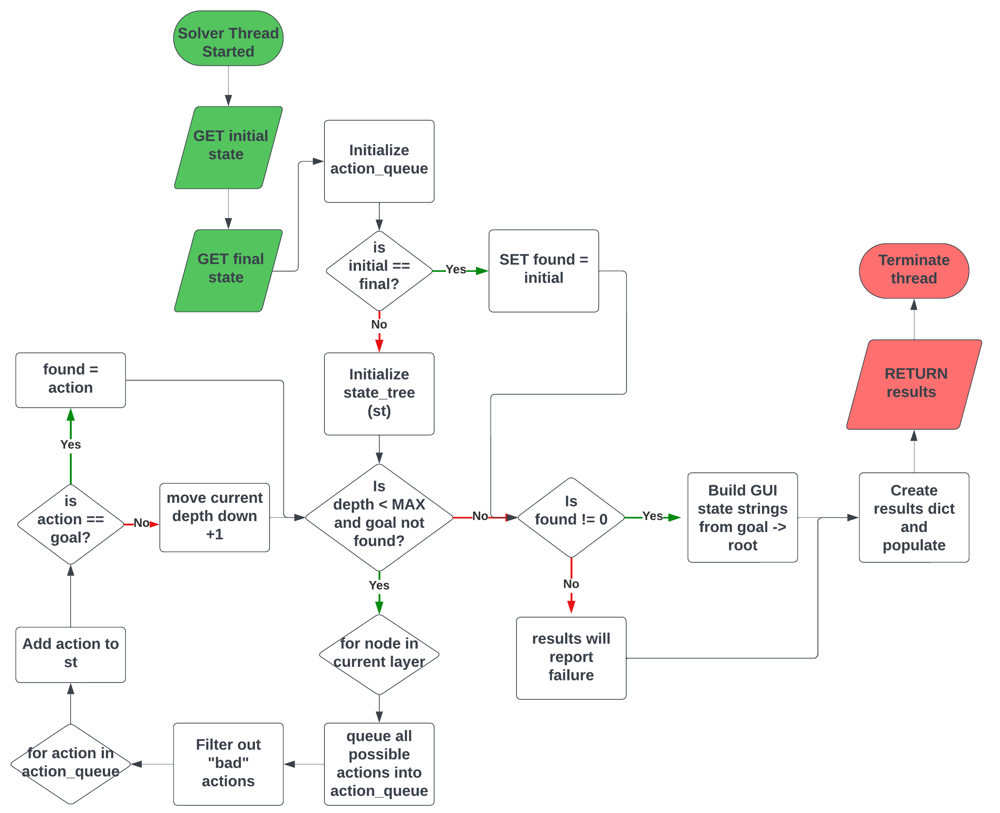

# CS4850-Final
Final Project for "Foundations of AI" CS4850

The World of Blocks problem is a classic Artificial Intelligence scheduling and planning problem [1] [2] [3] where a series of blocks are placed on a table in a particular configuration (an initial state), and a robotic arm is used to move the blocks around to reach a user-defined end (or goal) state.

To solve the World of Blocks problem, a method of “Breadth-First” searching was implemented in a layered tree structure. The general approach of the search is to cast a wide net of actions by loading every action that can be performed on a given state simultaneously, then comparing each generated state to the goal state. Should the goal state not be found, each created state’s possible actions are loaded, and the cycle repeats until the goal is found. A few optimizations were added, such as filtering redundant “inverse” actions or back-to-back movement actions. When found, the correct path of states is built from the goal up, creating a cohesive series of states that visually display moving from the initial state to the goal state.

## Use Guide
Enter commands into the GUI to set the initial state and final state

> Enter `help` command to view available commands

## Sources used
[1] M. R. Genesereth and N. J. Nilsson, Logical Foundations of Artificial Intelligence.
Morgan Kaufmann, 1987.

[2] A. Dixit, “Goal stack planning for blocks world problem,” Medium,
https://apoorvdixit619.medium.com/goal-stack-planning-for-blocks-world-problem-4177
9d090f29 (accessed Nov. 27, 2023).

[3] “The blocks world,” Introduction to AI - Week 8,
https://www.cs.bham.ac.uk/~mmk/Teaching/AI/l8.html (accessed Nov. 27, 2023).

[4] “Search algorithms in ai,” GeeksforGeeks,
https://www.geeksforgeeks.org/search-algorithms-in-ai/ (accessed Nov. 27, 2023).